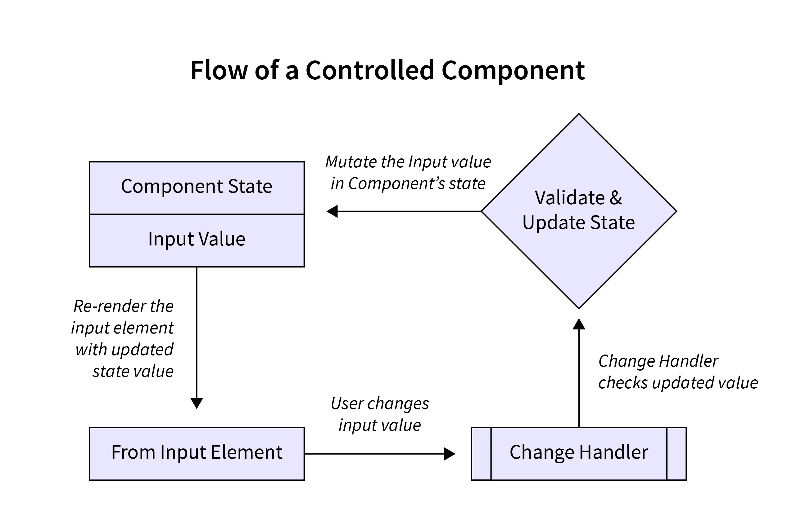
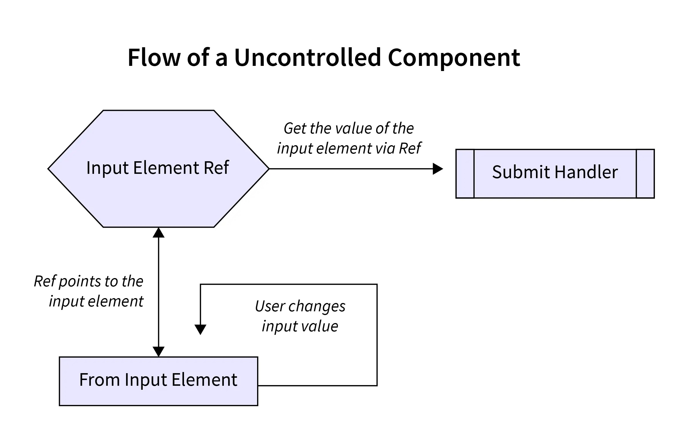
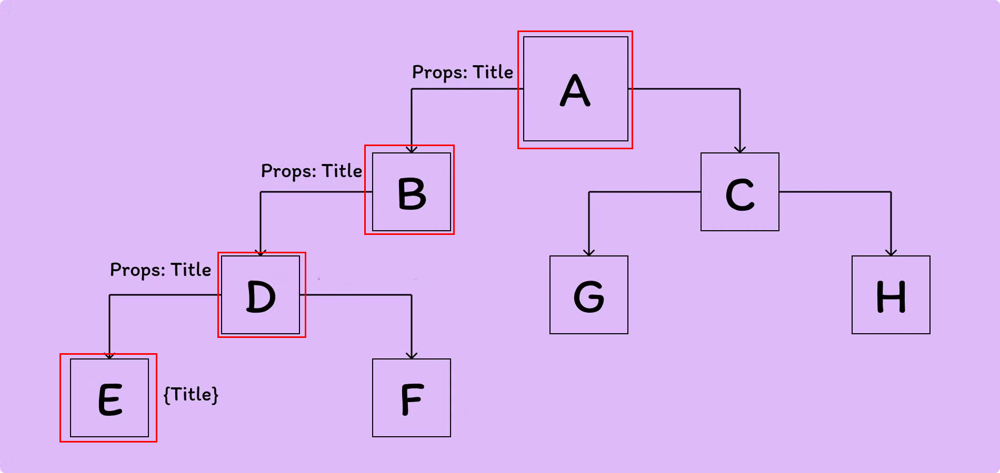
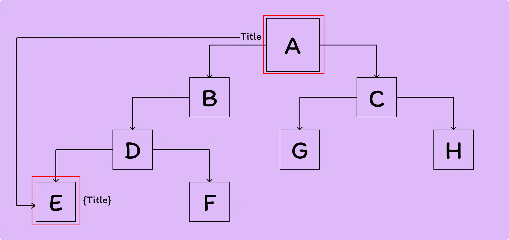

# React JS

<details>
<summary>About React JS</summary>

## About React Js
- ReactJS is a JavaScript library for building user interfaces
- ReactJS is declarative, efficient, and flexible
- It is fast and component-based
- It was initially developed and maintained by Facebook
- React breaks web elements down into reusable components making it easy to mange complex web interfaces.
- React's Virtaul DOM is a JavaScript representation of the actual DOM. When updates are made React compares the current DOM to the virtual DOM and only updates the differences between the two.

## Components
- Components are the foundation upon which you build user interfaces(UI)
- It is the Building blocks of user interface
- In a React app, every piece of UI is a component
- A React component is a JavaScript function that you can sprinkle with markup except:
    - Their names always begin with a capital letter.
    - They return JSX markup
- Each component exists in the same space but works independently
- Splits UI into independent and reusable pieces
- All of the components are being merged in a parent component (the final UI)
- Acceptsinput called props (optional) and returns react element
- Reusable having their own structure and methods


#### 4 ways to define components
- similar in look, different in data
- container component
- No common pattern, but breakdown for working purpose
- Stand-alone component

#### How to Build a Component?
- Export the component
- Define the function
    ```jsx
    export default function Profile() {

    }
    ```
- Add markup
    ```jsx
    retrun (
        
    )
    ```
- Whole component:
    ```jsx
    export default function Profile() {
        retrun (
            
        )
    }
    ```
    without parentheses, any code on the lines after return will be ignored!

#### Advantages of Components
- Code reusability
- Rast development
- Design consistency
- Maintainability (update just one component & get result in all spaces realted to this component)


## JSX
- JSX is a syntax extension for JavaScript
- JSX stands for JavaScript XML
- Lets you write HTML- like markup inside a JavaScript file.
- Under the hood it is transformed into regular JavaScript using compilers like Bable or TypeScript

#### Rules of JSX
- Return a single root element
    - To return multiple elements from a component, wrap them with a single parent tag.
- Close all the tags
- Must use camelCase
    - class --> className
    - onclick --> onClick
    - tabindex --> tabIndex


</details>
<details>
<summary>Getting Start with React</summary>


# Start React Simply with Vite

+ npm create vite@latest project-name -- --template react
+ for proceed press (y)
After that
+ using cd enter the project folder
+ then --> npm install (Create node_modules folder)
+ for run --> npm run dev or npx vite
+ for build --> npm run build or npx vite build (create dist folder)

# Start React with Tailwind & DaisyUI
- Create new React app with Vite
    ```cmd
    npm create vite@latest name-of-your-project -- --template react
    cd <your new project directory>
    ```
- Install React Router
    ```cmd
    npm install react-router-dom
    ```
- Create and render a browser router in `main.jsx`
    ```jsx
    // Existing code
    import {
        createBrowserRouter,
        RouterProvider,
    } from "react-router-dom";

    const router = createBrowserRouter([
        {
            path: "/",
            element: <div>Hello world!</div>,
        },
    ]);
    <StrictMode>
        <RouterProvider router={router}></RouterProvider> // include router here
    </StrictMode>,
    ```
- Install Tailwind
    ```cmd
    npm install -D tailwindcss postcss autoprefixer
    npx tailwindcss init -p
    ```
- Add the paths to all of our template files in our `tailwind.config.js` file
    ```js
    /** @type {import('tailwindcss').Config} */
    export default {
    content: [
        "./index.html",
        "./src/**/*.{js,ts,jsx,tsx}",
    ],
    theme: {
        extend: {},
    },
    plugins: [],
    }
    ```
- Add the Tailwind directives to your `index.css`
    ```css
    @tailwind base;
    @tailwind components;
    @tailwind utilities;
    ```
- Install DaisyUI
    ```cmd
    npm i -D daisyui@latest
    ```
- Add daisyUI to `tailwind.config.js`
    ```js
    import daisyui from 'daisyui'
    ...
    ...
    ...
    module.exports = {
    //...
    plugins: [daisyui],
    }
    ```
- Run our build process with:
    ```cmd
    npm run dev
    ```

### Folder Structure
+ node_modules
+ public
+ src
    + assets
        + css
        + images
    + pages
    + component


## VS code extension
+ npm intellisense
+ ESLint
+ Auto import- ES6, JSX, TSX.
+ Auto Tag
+ Auto Rename tag
+ Path intelliense
+ Postman
+ Prettier - code formater
+ Snipped
+ Tailwind CSS IntelliSense
+ Vscode react refactor
+ vscode-icons

</details>

<details>
<summary>About React Component</summary>

## What is React Component?
In React, a component is the building block of a user interface. Components allow you to break down complex UIs into smaller, reusable pieces.
There are two main types of React componets:
### 1. Functional Components
These are simple JavaScript functions that accept `props` (data passed from the parent component) and return React elements. They're easy to write and are often preferred for simple UI elements. For example:
```jsx
function Greeting(props) {
  return <h1>Hello, {props.name}!</h1>;
}
```

### 2. Class Components:
 These are ES6 classes that extend `React.Component`. They offer more features, like local state and lifecycle methods (e.g., `componentDidMount, componentDidUpdate`). For example:
 ```jsx
 class Greeting extends React.Component {
  render() {
    return <h1>Hello, {this.props.name}!</h1>;
  }
}
```
Modern React mostly leans towards functional components, especially with the introduction of React Hooks (like useState, useEffect), which allow functional components to handle state and lifecycle features.

### Key Concepts in React Components:
`1. Props:` Short for `proporties,` these are the inputs to a React component. They are passed to components via attributes and are read-only (cannot be modified by the component itself).
`2. State:` They are passed to components via attributes and are read-only (cannot be modified by the component itself).
`3. Lifecycle Methods:` These are methods you can use in class components to hook into different phases of a component's life (mounting, updating, and unmounting).
`4. Hooks:` React hooks (like useState, useEffect) allow you to use state and lifecycle features in functional components without writing a class.

</details>

<details>
<summary>About JSX</summary>

## What is JSX?
JSX stands for JavaScript XML. JSX allows us to write HTML in React. JSX makes it easier to write and add HTML in React. JSX allows us to write HTML elements in JavaScript and place them in the DOM without any `createElement()` and/or `appendChild()` methods.

>We are not required to use JSX, but JSX makes it easier to write React applications.

### JSX Conventions
- We need to return a single parent element in jsx.
- We can implement JS directly in jsx
- All tags self-close in jsx
- ClassName and HTMLFor, not class and for in jsx.
- Write all HTML attributes in camelCase in jsx
- Write inline styles as objects in jsx


</details>


<details>
<summary>About Props</summary>

## What are Props?
- React components use props to communicate with each other.
- Every parent component can pass some information to its child components by giving them props.
- You can pass any JavaScript value through props, including objects, arrays and functions.
- Props are unidirectional
- Props are Immutablep

#### Set value into the component using props
```jsx
// Main Function
    function FunctionName() {
        return (
            <>
                ...
                ...
                <Device name="Laptop" price="45k"></Device>
                ....
            </>
        )
    }

// Component
    function Device(props){
        return (
            <h2>Device Name: {props.name} and Price: {props.price}
        )
    }
```
#### Specifying a Default value for a Prop
```jsx
    function Avatar({person, size}){
        //.....
    }
```

#### Different values of Props
```jsx
    // 1. String literals
    <MyComponent prop="My String value"/>
    // 2. Template literals with variables
    <MyComponent prop={'My String value ${myVariable}'}/>

    // 3. Number literals
    <MyComponent prop={42} />

    // 4.Boolean literals
    <MyComponent prop={fallse} />

    // 5. Plain Obj. literals
    <MyComponent prop={{property: 'Value'}} />

    // 6.Array literals
    <MyComponent prop={['Item_1','Item_2']} />

    // 7. JSX
    <MyComponent prop={<Message who="Joker" />}/>

    // 8. Variables having any kind of value
    <MyComponent prop={myVariable}/>
```

#### Forwarding Props with JSX Spread Syntax
Without spread syntax(it's a repetitive way)

```jsx
    function Profile({person, size, isSepia}){
        return(
            <div className="card">
                <Avatar
                    person={person}
                    size={size}
                    isSepia={isSepia}
                />
            </div>
        );
    }
```

With spread syntax
```jsx
function Profile(props){
    retrun (
        <div className="card">
            <Avatar {...props}/>
        </div>
    );
}

```

</details>

<details>

<summary>File Export & Import</summary>

If we want to access any file components or information we need to export and import file.
- At first create a new file and add `export default` at the begining of the function:
    ```jsx
    export default function Todo(){
        return(
                <li>Accessing File</li>
            )
        }
    ```
- Import the file into main `App.jsx` file to access the information:
    ```jsx
    import FileName from './FileName';
    ```

</details>

<details>
<summary>React Rendering</summary>

### Conditional Rendering
- Conditional rendering is the process of displaying different content based on certain conditions or states.
- It allows you to create dynamic user interfaces that cn adapt to changes in data nad user interactions.

#### Why Conditional Rendering?
- Imporved User Experience: Conditional rendering allows you to create dynamic user interfaces by showing and hiding content based on the user's actions or the application state.
- Improved Performance: By conditionally rendering content, apps work faster byonly showing what's needed and improve the performance of your application.
- Simplified Code: By using conditional statements you can decide what content should be rendered, you can avoid duplicating code and create more modular components.
- Flexibility: By rendering different content based on the application state, you can create components that can be used in different contexts and adapt to different user interactions.

```jsx
// App.jsx
<Todo task="Core Concepts" isDone={true}></Todo>
<Todo task="Try JSX" isDone={false}></Todo>
```
### Conditional Rendering with if statement:
```jsx
// Todo.jsx
// ------Conditional rendering option: 1
export default function Todo({task, isDone}){
    if(isDone === true){
        return <li>Finished: {task}</li>
    }
    else{
        return <li>Work On: {task}</li>
    }
}
```
```jsx
// Todo.jsx
// ------Conditional rendering option: 2
export default function Todo({task, isDone}){
    if(isDone === true){
        return <li>Finished: {task}</li>
    }
    return <li>Work On: {task}</li>
}
```
### Conditional Rendering with ternary operator (?:):
```jsx
// Todo.jsx
// ------Conditional rendering option: 3
export default function Todo({task, isDone}){
    return (
        <li> {isDone ? 'Finished': 'Work on'}: {task} </li>   
    )
}
```
### Conditional Rendering with logical operator(&&,||):
```jsx
// ------Conditional rendering option: 4 && (behive like true)
export default function Todo({task, isDone}){
    return(
        <li>{task} {isDone && ': Done'}</li>
    )
}
// ------Conditional rendering option: 5 || (behive like false)
export default function Todo({task, isDone}){
    return(
        <li>{task} {isDone || ': Do it'}</li>
    )
}
```

</summary>


### Set value into the component using props
```jsx
// Main Function
    function FunctionName() {
        return (
            <>
                ...
                ...
                <Device name="Laptop" price="45k"></Device>
                ....
            </>
        )
    }

// Component
    function Device(props){
        return (
            <h2>Device Name: {props.name} and Price: {props.price}
        )
    }
```

### Set value into the component using destructing
```jsx
// Main Function
    function FunctionName() {
        return (
            <>
                ...
                ...
                <Device name="Laptop" price="45k"></Device>
                ....
            </>
        )
    }

// Component
    function Device({name, price}){
        return (
            <h2>Device Name: {name} and Price: {price}
        )
    }
```
</details>

<details>
<summary>Event Handling</summary>

### Event Handling

React lets you add event handlers to your JSX. Event handlers are your own functions that will be triggered in response to interactions like clicking, hovering, focusing form inputs etc.
Example:
```jsx
<button onClick={myFunction}>Button Name</button>

```

### Adding Event Handler:
```jsx
// Event handling way -1
export default function Button() {
    function handleClick() {
        alert('You clicked me!');
    }

    return (
        <button onClick={handleClick}>Click Me</button>
    );
}

```
```jsx
// Inline Event handler in JSX
<button onClick={function handleClick(){
    alert('You clicked me!');
    }}>
    Click me</button>
```
```jsx
<button onClick={() =>{
    alert('You clicked me!');
}}>Click me!</button>
```

### Rules of Adding Event Handler
- **Event handler functions:**
    - Are usually defined inside your componets.
    - Have names that start with handle, followed by the name of the event.
- **By convention,** it is common to name event handlers as handle followed by the event name:
    - onClick = {handleClick}
    - onMouseEnter = {handleMouseEnter}

**`Note:`** Functions passed to event handlers must be passed, not called!
Example:
```jsx
// passing a function - use it
<button onClick={handleClick}>Click me</button>
```
```jsx
// calling a function - not use it
<button onClick={handleClick()}>Click me</button>
```

</details>

<details>
<summary>React Hook</summary>

### What are react hooks?
Hooks were first introduced in React 16.8. Hooks let you use different React feaatures from your components. You can either use the build-in Hooks or combine them to build your own.

### Rules of Hooks


### Different Types of Hooks
- State hooks
- Context hooks
- Ref hooks
- Effect hooks
- Performance hooks
- Other

### State hooks
- State lets a component "remember" information like user input.
- To add state to a component, use one of these Hooks:
    - `useState`declares a state variable that you can update directly.
    - `useReducer` declares a state variable with the update logic inside a reducer functin.
    ```jsx
        function ImageGallery(){
            const [index, setIndex] = useState(0);
            // ...........
        }
    ```

### Context hooks
- Context lets a component receive information from distat parents without passing it as props.
- useContext reads and subscribes to a context
    ```jsx
        function Button(){
            const theme = useContext(ThemeContext);
            // ...........
        }
    ```

### Ref hooks
- Refs let a component hold some information that isn't used for rendering, lie a DOM node or a timeout ID.
- useRef declares a ref. You can hold any value in ti, but most often it's used to hold a DOM node.
    ```jsx
        function Form(){
            const inputRef = useRef(null);
            // ...........
        }
    ```

### Effect hooks
- Effects let a component connect to and synchronize with external systems. This includes dealing with network, browser DOM, animations, widgets written using a different UI library, and other non-React code.
- useEffect connects a component to an external system.

    ```jsx
        function chatRoom({roomId}){
            useEffect(() => {
                const connection = createConnection(roomId);
                connection.connect();
                return () => connection.disconnect();
            }, [roomId]);
            //.............. 
        }
    ```
</details>

<details>
<summary>React  useState()</summary>

### What exactly is state?
- Components often need to change what's on the scree as a result of an interaction.
- Typing into the form should update the input field, clicking, "next" on an image carousel should change which image is displayed, clicking "buy" should put a product in the shopping cart.
- Components need to "remember" things: the current input value, the current image, the shopping cart. In React, this kind of component-specific memory is called state.

### How to write a useState Hook
The useState hook provides those two things:
- A state variable to retain the data between renders.
- A state setter function to update the variable and trigger React to render the component again.

    

```jsx
    const [counter, setCounter] = useState(0);
    const clickHandlerIncrease = () => {
        const newCount = counter + 1;
        setCounter(newCount);
    }
```

### Why useState() is needed?
To update a component with new data, two things need to happen:
- Retain the data between renders.
- Trigger React to render the component with new data(re-rendering).

Variable do not preserve data between renders and cannto tigger React to render. Hense, useState is needed as it preserves data since it is a memeroy as well trigger React to render with teh help of setter function.

### 5 use cases of useState()
- State management
- Conditional rendering
- Toggle flags (true/false)
- Counter
- Store API data in state

</details>

<details>
<summary>React useEffect</summary>

### What are Effects?
There are two types of logic inside React components:
- `Rendering code:` lives at the top level ofyour component. This is where you take the props and state, transform them, and returnthe JSX you want to see on the screen.
- `Event handlers:` An event handler might update an input field, submit an HTTP POST request to buy a product, or navigate the user to another screen.

Event handler contain "side effects" (they change the program's state) caused by a specific user action (for example, a button click or typing).

### What are side effects in react?
- Not predictable
- Actions which are performed with the "outside world"
- A side effect is performed when we need to reach outside the scope of our current react components to do something.
- React component rendering and side-effect logic are independent

### Some common side effects-
- Making a request to an API for data from a backend server
- To interect with browser APIs (that is, to use document or window directly)/ Manipulating DOM directly
- Using unpredictable timing functions like setTimeout() or setInterval()
- Reading data from local storage

### What is useEffect?
userEffect exists-
- To synchronize a component with an external system
- To provide a way to handle performing these side effects
- Doesn't affect the rendering or performance of the component that it's in
- Performs asynchronous task


### How to write an Effect
To write an Effect, follow these three steps:
1. `**Declare an Effect**` By default, your Effect will run after every render. To declare an Effect in your component, import the useEffect Hook from React
    ```jsx
    import {useEffect} from 'react';
    ```
    - Then call it at the top level of your component and put some code inside your Effect:
    ```jsx
    function MyComponent(){
        useEffect(() => {
            // code here will run after every render
        });
        return <div/>;
    }
    ```
2. `**Specify the Effect dependencies.**` Most Effects should only re-run when needed rather than after every render. For example, a fade-in animation should only trigger whena component appears.
3. `**Add cleanup if needed.**` Some effects need to specify how to stop , undo, or clean up whatevr they were doing. For example, "connect" needs "disconnect".

### Different types of dependency in useEffect
1. Runs after every render
    ```jsx
    useEffect(() => {
        // This runs after every render
    })
    ```
2. Runs only once after initial render
    ```jsx
    useEffect(() =>{
        //Runs only once after initial render
    },[]);
    ```
3. Runs on mount and also if either a or b have change since the last render
    ```jsx
    useEffect(() =>{
        /* This runs on mount *and also* 
        if either a or b have changed
        since the last render*/
    },[a,b]);
    ```

### What is useEffect cleanup function?
- The useEffect cleanup allows us to tidy up our code before our component unmounts.
- When our code runs and results for every render, useEffect also cleans up after itself using the cleanup function.
- The cleanup function prevents memory leaks and removes some unnecessary and unwanted behaviors.
- Prevent unwanted behaviors and optimizes application performance.

</details>

<details>
<summary>Trigger, Render an Commit in React</summary>

## What does Render means?
- Before your components are displayed on screen, they must be rendered by React.
- "Rendering" means that React is calling your component, which is a function.

### Trigger, render and commit
Imagine that your componets are cooks in the kitchen. In this scenario, React is the waiter who puts in requeests from customers and brings them their orders. This process of requesting and serving UI has three steps:

1. Triggering a render(delivering the guest's order to the kitchen)
2. Rendering the componet(preparing the order in the kitchen)
3. Committing to the DOM(placing the order on the table)

    

### Step-1: Trigger a render
There are two reasons for a component to render:
- It's the component's initial render.
- The component's(or one of its ancestors) state has been updated.
#### Initial Render
When your app starts, you need to trigger the initial render. It's done by calling createRoot with teh target DOM node, and then calling its render method with your component
#### Re-renders when state updates
- Once the component has been initially rendered, you can trigger further renders by updating its state with the set function. Updating your component's state automatically queues a render.
- You can imagine these as a restaurant guest ordering tea, dessert, and all sorts of things after puttin gin their first order, depending on the state of their thirst or hunger.

### Step 2: React renders your components
After you trigger a render, React calls your components to figure out what to display on screen.. "Rendering" is React calling your components.
- On initial render, React will call the root component.
- For subsequent renders, React will call the function componet whose state update tirggerd  the render.

This process is recursive: if the updated component returns some other component, React will render that component next, and if that component also returns something, it will render that component next, and as on.

### Step 3: React commits changes to the DOM
After rendering (calling) your components, React will modify the DOM.
- For the initial render, React will use the appendChild() DOM API to put all the DOM nodes it has created on screen.
- For re-renders, React will apply the minimal necessary operations (calculated while rendering) to make the DOM match the latest rendering output.

React only changes the DOM nodes if there's a difference between renders.

</details>

<details>
<summary>Thinking in React way</summary>

### When you build a user interface with React-
**Step-1:** Break it apart into pices called components.
**Step-2:** Describe the different visual states for each of the components.
**Step-3:** Connect the components together so that the data flows through them.

All Steps:
**Step-1:** Break the UI into a component hierarchy
**Step-2:** Build a static version in React
**Step-3:** Find the minimal but componet representation of UI state
**Step-4:** Identify where your state should live
**Step-5:** Add inverse data flow

</details>

<details>
<summary>Type Error Handle</summary>

`prop-types` errors handle: For deactivate the prop-types error go to the  `eslint.config.js` file under the `rules:` section include this rules: `'react/prop-types': 'off'`. 
>It is not the best practice to handle this error. as a beginner it's ok. 
```js
rules: {
      ...js.configs.recommended.rules,
      ...react.configs.recommended.rules,
      ...react.configs['jsx-runtime'].rules,
      ...reactHooks.configs.recommended.rules,
      'react/jsx-no-target-blank': 'off',
      'react-refresh/only-export-components': [
        'warn',
        { allowConstantExport: true },
      ],
      'react/prop-types': 'off' //this is the rule
    },
```

</details>

<details>
<summary>Deploy Using Surge</summary>

- At first install surge:
    > npm install -g surge
- For build the project run:
    > npm run build
- Then create dist using command:
    > surge dist

</details>

<details>
<summary>React Router</summary>

- React Router is a lightweight, fully-featured routing library for the React JavaScript library.
- It allwos developers to create user interfaces using UI components and single-page applications.
- One of the most important features we always want to implement when developing these applications is routing.
- Routing is the process of redirecting a user to different pages based on their action or reuest.

## Setup
- Open up the terminal
    ```cmd
    npm create vite@latest name-of-your-project -- --template react
    # follow prompts
    cd <your new project directory>
    npm install react-router-dom # always need this!
    npm install localforage match-sorter sort-by # only for this tutorial.
    npm run dev
    ```

### Adding a Router

First thing to do is create a Browser Router and configure our first route. This will enable client side routing for our web app.

The `main.jsx` file is the entry point. Open it up and we'll put React Router on the page.

> Change 3 section into the `main.jsx` file.

```jsx
import { StrictMode } from 'react'
import { createRoot } from 'react-dom/client'
import App from './App.jsx'
import './index.css'

// First import the router configuration
import {
  createBrowserRouter,
  RouterProvider,
} from "react-router-dom";

// Second Create Router
const router = createBrowserRouter([
  {
    path: '/',
    element: <div>Hello from react router!!</div>
  },
  {
    path: '/about',
    element: <About></About>
  },
  {
    path: '/contact',
    element: <Contact></Contact>
  }
]);

createRoot(document.getElementById('root')).render(
  <StrictMode>
    // Third Include the router here
    <RouterProvider router={router}></RouterProvider>
  </StrictMode>,
)
```

### How to write Nested Routes in createBrowserRouter()
1. `createBrowserRouter()` - used to create a router object by passing a list of route objects.

```jsx
// .... Existing Code......

const router = createBrowserRouter([
  {
    path: '/',
    element: <Home></Home>,
    children: [
      {
        path: '/about',
        element: <About></About>
      },
      {
        path: '/contact',
        element: <Contact></Contact>
      }
    ]
  }
]);
// .... Existing Code......
```
- Include `<Outlet/>`: The react `<Outlet/>` component (from react-router-dom) is used within the parent route element to indicate where a child route element should be rendered.

```jsx
import { Outlet } from "react-router-dom";
// -------Existing Code----
<div>
    <Navbar></Navbar>
    <Outlet></Outlet>
    <Footer></Footer>
</div>
// ------Existing code ------
```
### `<Link>` ELement:
- A `<Link>` is an element that lets the user navigate to another page by clicking or tapping on it.
- THe `to` prop specifies the location to which the user will be redirected after clicking on the `<Link>`.
- Rendering a `<Link>` will insert an anchor tag `(<a>)` in our HTML documents, but the anchor's default behavior (triggering a page reload) will be disabled.

```jsx
<Link to "/about">About</Link>
```


### `<NavLink>` Element:
- A `<NavLink>` is a special kind of `<Link>` that knows whether or not it is "active" or "pending".
- This is useful when building a navigation menu, such as a breadcrumb or a set of tabs where you''d like to show which of them is currently selected.
```jsx
<NavLink
  to="/messages"
  className={({ isActive, isPending }) =>
    isPending ? "pending" : isActive ? "active" : ""
  }
>
  Messages
</NavLink>;
```
- Active Route using NavLink:
```jsx
<nav>
    <NavLink to="/">Home</NavLink>
    <NavLink to="/about">About</NavLink>
    <NavLink to="/contact">Contact Us</NavLink>
    <NavLink to="/users">Users</NavLink>
    <NavLink to="/posts">Posts</NavLink>
</nav>
```
Style the active route:
```css
nav a.active{
    color: white;
    text-decoration: underline;
}
```

### Loading Data using useLoaderData():
`useLoaderData()`- This hook provides the value returned from your route loader. Each route can define a "loader" function to provide data to the route element before it renders.
- At first used loader inside the `main.jsx`:
    ```jsx
    //Existing code
    {
        path: '/users',
        loader: () => fetch('https://jsonplaceholder.typicode.com/users'),
        element: <Users></Users>
      },
      //Existing code
    ```
- Get data from components
    ```jsx
    import { useLoaderData } from "react-router-dom";
    ..
    ..
    const users = useLoaderData();
    ..
    ..
    ```

### useParams() Hooks:
 This hook returns an object of key/value pairs of the dynamic params from the current URL that were matched by the `<Route path>`.

 ```jsx
import { useParams } from 'react-router-dom';
let {userId} = useParams();
 ```

### Dynamic Route:
- Inside the components:
    ```jsx
    return (
        <div style={userStyle}>
            <h2>{name}</h2>
            <p>Email: {email}</p>
            <p>Phone: {phone}</p>
            <Link to={`/user/${id}`}>Show Details</Link> //This is the dynamic urls
        </div>
    );
    ```

- Create dynamic path route inside the `main.jsx`:
    ```jsx
    {
        path: 'user/:userId',
        element: <UserDetails></UserDetails>
      }
    ```
### Get single user data from dynamic route:
```jsx
{
    path: 'user/:userId',
    loader: ({params}) => fetch(`https://jsonplaceholder.typicode.com/users/${params.userId}`),
    element: <UserDetails></UserDetails>
}
```

### useNavigate() Hooks:
The `useNavigate()` hook returns a function that lets us navigate programmatically. It returns a function that can be invoked with a URI to redirect the client to the respective page.

```jsx
import { Link, useNavigate } from "react-router-dom";

const Post = ({post}) => {
    const navigate = useNavigate();
    
    const handleShowDetail = () =>{
        navigate(`/post/${id}`);
    }
    return (
        <div>
            <button onClick={handleShowDetail}>Click to see details</button>
        </div>
    );
}
```

## Dynamic Routing using OnClick Method:
- Import and Create navigate function
    ```jsx
    import { useNavigate } from "react-router-dom";
    const navigate = useNavigate();
    ```
- Create onclick handle function:
    ```jsx
    const handleShowDetail = () =>{
        navigate(`/post/${id}`);
    }
    ```
- Integrate with button:
    ```jsx
    <button onClick={handleShowDetail}>Click to see details</button>
    ```
## Go Back Navigate:
- Create navigate function using useNavigate()
    ```jsx
    import { useNavigate } from "react-router-dom";
    const navigate = useNavigate();
    ```
- Create handle function:
    ```jsx
    const handleGoBack = () =>{
        navigate(-1);
    }
    ```
- Integrate with button
    ```jsx
    <button onClick={handleGoBack}>Go Back</button>
    ```

## Error Page
Handle (Error, not fount/404) page:
- Create a component with better UI:
    ```jsx
    import { Link, useRouteError } from "react-router-dom";

    const ErrorPage = () => {
        const error = useRouteError();
        return (
            <div>
                <h2>Oops!!!</h2>      
                <p>{error.statusText ||  error.message}</p>  
                {
                    error.status === 404 && <div>
                        <h3>Page Not found</h3>
                        <p>GO back where you from</p>
                        <Link to="/"><button>Home</button></Link>
                    </div>
                }    
            </div>
        );
    };

    export default ErrorPage;
    ```
- Include this components below the parent elements inside the `main.jsx`:
    ```jsx
        path: '/',
        element: <Home></Home>,
        errorElement: <ErrorPage></ErrorPage>, //This is the components
        children: [
            ..
            ..
            ..
        ]
    ```
### `<Navigate>` Component:
- `<Navigate>`- This component is a build-in components in React router version 6.
- It is a wrapper for the useNavigate hook, and the current location changes when you render it
- It accepts all the same arguments as props.
```jsx
<div>
    {error && <p>{error.message}</p>}
    {user && (
        <Navigate to="/dashboard" replace={true} />
    )}
</div>
```

### useNavigation() Hook:
- This Hook gives the developer access to properties that show the state of a currently rendered route.
- For example, this Hook can indicate when a route is "loading" or when a form on the route is "submitting" as well as "idle" when there is no navigation pending.
- It is useful for building loading indicators or optimistically updating data on a page.

```jsx
import { useNavigation } from "react-router-dom";

const Home = () => {
    const naviation = useNavigation();
    return (
        <div>
            <Header></Header>
            {
                naviation.state === "loading" ? 
                <p>Loading........</p>:

            }
            <Footer></Footer>
        </div>
    );
};
```
</details>

<details>
<summary> Concept of useRef()</summary>

## What is useRef?
useRef is a react hook that lets you reference a value that's not needed for rendering. useRef to create a reference to the element and access value by using like: nameRef.current.value

```jsx
const ref = useRef(initialValue)
```

### Parameters:
InitialValue:
- THe value we want the ref object's current property to be initially.
- It can be value of any type.
- This argument is ignored after the initial render.

### Returns:
- Returns an object with a single property current.
- Initially, it's set to the initialValue we have passed. We can later set it to something else.
- If we pass the ref object to react as a ref attribute to a JSX node, React will set its current property.
- On the next renders, useRef will return the same object.

### Pitfall
- We can mutate the `ref.current` property. Unlike state, it is mutable.
- When we change the `ref.current` property, React does not re-render our component.
- In Strict Mode, React will call our component function twice in order to help us find accidental impurities. This is development-only behavior and does not affect productin. Each ref object will be created twice, but one of the versions will be discarded.

## Get input field value using useRef()

- At first create useRef() hook for every input field
    ```jsx
    import { useRef } from "react";
    const nameRef = useRef(null);
    ```
- Include the useRef() inside the input field
    ```jsx
    <input ref={nameRef} type="text" name="name" />
    ```

## Initially set the Cursors into the first input field
```jsx
    useEffect(()=>{
        nameRef.current.focus();
    },[])
```

## Set defaultvalue into the input value
```jsx
<input ref={emailRef} type="email" defaultValue={'example@gmail.com'} name="email" id="" />
```

</details>

<details>
<summary>Controlled and Uncontrolled Components</summary>

# Controlled Components
- In a controlled component, the state of the form elements is `controlled by React.`
- The value of the input is set throught the component's state and is `updated through event handlers.`
- When  the input value changes, the state is updated, and `React re-renders the component to reflect the new value.`
- Controlled components offer `more control over the form's behavior` and provide a clear data flow.

### Flow of a Controlled Component:


### Advantages of Controlled Components:
- The instant validation check is oneof the major benefits of using the controlled component over the uncontrolled component in react.
- We can have validation checks on every keystroke of the user when using controlled components in react. This is because we can access the input value at every time with the help of react state.
- In contrast, in a uncontrolled component, the input value is only available when the form is submitted by the user.
- > For example, we can perform a validation check on the user input(password type) where the requirement is that  the input password should be at least eight characters and display a conditional message accordingly.

# Unconttrolled Components
- In an uncontrolled component, the form element's state is manage by the DOM rather than React. We can directly access the DOM element using references after rendering.
- Thus uncontrolled components do not depend on any state of input elements or any event handler. This type of component does not care about real-time input changes.

### Flow of an Uncontrolled Component:


</details>

<details>
<summary>Different Types of form in React</summary>

## Simple Form:
```jsx

const SimpleForm = () => {
    const handleFormSubmit = e =>{
        e.preventDefault();
        console.log(e.target.name.value);
        console.log(e.target.email.value);
        console.log(e.target.phone.value);
        console.log('Form Submitted')
    }
    return (
        <div>
            <form onSubmit={handleFormSubmit}>
                <input type="text" name="name" />
                <br />
                <input type="email" name="email" id="" />
                <br />
                <input type="text" name="phone" id="" />
                <br />
                <input type="submit" value="Submit" />
            </form>
        </div>
    );
};

export default SimpleForm;
```

## Stateful Form:
```jsx
import { useState } from "react";

const StatefulForm = () => {
    const [name, setName] = useState(null);
    const [email, setEmail] = useState(null);
    const [password, setPassword] = useState(null);

    const handleFormSubmit = e =>{
        e.preventDefault();
        console.log(name)
        console.log(email)
        console.log(password)
    }

    const handleNameChange = e =>{
        setName(e.target.value);
    }

    const handleEmailChange = e =>{
        console.log(e.target.value)
        setEmail(e.target.value);
    }

    const handlePasswordChange = e =>{
        setPassword(e.target.value);
    }

    return (
        <div>
            <form onSubmit={handleFormSubmit}>
                <input 
                onChange={handleNameChange}
                type="text" name="name" />
                <br />
                <input 
                onChange={handleEmailChange}
                type="email" name="email" id="" />
                <br />
                <input
                onChange={handlePasswordChange}
                type="password" name="password" id="" />
                <br />
                <input type="submit" value="Submit" />
            </form>
        </div>
    );
};

export default StatefulForm;
```

## Form using useRef():
```jsx
import { useEffect, useRef } from "react";

const RefForm = () => {
    const nameRef = useRef(null);
    const emailRef = useRef(null);
    const passwordRef = useRef(null);

    const handleFormSubmit = e =>{
        e.preventDefault();
        console.log(nameRef.current.value)
        console.log(emailRef.current.value)
        console.log(passwordRef.current.value)
    }

    useEffect(()=>{
        nameRef.current.focus();
    },[])

    return (
        <div>
            <form onSubmit={handleFormSubmit}>
                <input ref={nameRef} type="text" name="name" />
                <br />
                <input ref={emailRef} type="email" defaultValue={'example@gmail.com'} name="email" id="" />
                <br />
                <input ref={passwordRef} type="password" name="password" id="" />
                <br />
                <input type="submit" value="Submit" />
            </form>
        </div>
    );
};

export default RefForm;
```

</details>

<details>
<summary>Custom Hook for managing the state of an input field</summary>

### Code Breakdown:
```js
import { useState } from "react"

const useInputState = (defaultValue=null) =>{
    // ---first declare useState()
    const [value, setValue] = useState(defaultValue);

    // --- on change method to manage state
    const handleChange = e =>{
        setValue(e.target.value);
    }

    // --- return the value and 
    return [value, handleChange];

}

export default useInputState;

```
### Explanation:
**Initial Setup (`useState`):**

- The line` const [value, setValue] = useState(defaultValue);` initializes a state variable `value` and a setter function `setValue`.
- `useState` is used to store the value of the input, and `defaultValue` is the initial value provided when the hook is called.
- If no default value is provided, it will be set to `null`.

**Handling Changes (`handleChange`):**

- `e.target.value:` In a form input event, `e` is the event object, and `e.target` refers to the DOM element (in this case, the input field). `e.target.value` retrieves the current value of that input field.
- `setValue(e.target.value):` This updates the state (`value`) with the new input value, using the `setValue` function from `useState`.

**Return Values:**

- The hook returns an array containing two elements: `[value, handleChange]`.
- `value`: The current value of the input field (managed by `useState`).
- `handleChange`: A function to update the value when an input changes.

**Usage:** 
- This hook would be used in a component to manage the state of an individual input field.

</details>

<details>
<summary>Reusable Form</summary>

- At first create a Component. Inside the computer include the form like this:
    ```jsx
        <form>
            <input type="text" name="name" />
            <br />
            <input type="email" name="email" id="" />
            <br />
            <input type="password" name="password" id="" />
            <br />
            <input type="submit" value="Submit" />
        </form>
    ```

- Include the `ReusableForm` component inside the `App.jsx` or where we need.
    ```jsx
    <ReusableForm></ReusableForm>
    ```
- If we need, we can set dynamic text into the form like: submit btn text, form title and description. also onsubmit handler.
    ```jsx
    <ReusableForm
        formTitle={'User Registration Form'}
        submitBtnText={'Sign Up'}
        handleFormSubmit={handleUpdateProfile}
      ></ReusableForm>
    ```
- Get the dynamic data as props from the component:
    ```jsx
    const ReusableForm = ({formTitle, handleFormSubmit, submitBtnText='Submit', children}) => {
        ...
        ...
    }
    ```
- Using `children` props we can pass as `div` and get multiple information without individual props like: formTitle, formDescription.
    ```jsx
    <ReusableForm
        submitBtnText={'Update'}
        handleFormSubmit={handleUpdateProfile}
      >
        <div>
          <h2>Profile Update From</h2>
          <p>Lorem ipsum dolor sit amet, consectetur adipisicing elit. Reiciendis, dolor!</p>
        </div>
      </ReusableForm>
    ```
- For display on the form used dynamic `{children}` above the form:
    ```jsx
    <div>
        {children}
        <form onSubmit={handleLocalSubmit}>
            <input type="text" name="name" />
            <br />
            <input type="email" name="email" id="" />
            <br />
            <input type="password" name="password" id="" />
            <br />
            <input type="submit" value={submitBtnText} />
        </form>
    </div>
    ```
- Include the `onSubmit` handler:
    ```jsx
    <form onSubmit={handleLocalSubmit}>
    ----
    ---
    ```
- For get and manage the submit state:
    ```jsx
    const handleLocalSubmit = e =>{
        e.preventDefault();
        const data = {
            name: e.target.name.value,
            email: e.target.email.value,
            password: e.target.password.value,
        }
        handleFormSubmit(data);
    }
    ```

</details>

<details>
<summary>Concept of Context API</summary>

## What is it
It call `useContext` at the top level of our component to read and subscribe to context.

```jsx
import { useContext } from 'react';

function MyComponent() {
    const theme = useContext(ThemeContext);
    // .........
}
```

### Parameters:
- `SomeContext:` The context that we've previously create with createContext.
- The context itself does not hold the information, it only represents the kind of information we can provide or read from components.

### Returns:
- `useContext` returns the context value for the calling component.
- It is determined as the `value` passed to the closest `SomeContext.Provider` above the calling component in the tree.
- If there is no such provider, then the returned value will be the `defaultValue` we have passed to createContext for that context.
- The returned value is always up-to-date. React automatically re-renders components that read some context if it changes.

### Usage:
- Passing data deeply into the tree
- Updating data passed via context 
- Specifying a fallback default value
- Overriding context for a part of the tree
- Optimizing re-renders when passing objects and functions

### Problem with props drilling:


### Solution with Context API


#### **Step-1:** Create a context Object
```jsx
// MyContext.jsx
import { createContext } from 'react';

export const MyContext = createContext("");
```

#### **Step-2:** Wrap the parent component component with provider
```jsx
// App.jsx
import { useState, React } from "react";
import { MyContext } from "./MyContext";
import MyComponent from "./MyComponent";

function App(){
    const [text, setText] = useState("");

    return (
        <div>
            <MyContext.Provider value = {{ text, setText }}>
                <MyComponent ></MyComponent>
            </MyContext.Provider>
        </div>
    );
}

export default App;
```

#### **Step-3:** Consume the Context
```jsx
// MyComponent.jsx
import { useContext } from "react";
import { MyContext } from "./MyContext";

function MyComponent() {
    const { text, setText } = useContext(MyComponent);

    return (
        <div>
            <h1>{text}</h1>
            <button onClick={() => setText('Hello, World')}> Click Me </button>
        </div>
    );
}

export default MyComponent;

```

### Use cases
- **Theming:** Dark or light theme for our website and pass it down to all the component.
- **User Authentication:** A user's authentication status and pass it down to all the components.
- **Multilingual Support:** Current language of your application in the context and pass it down to all components.
- **Accessing data from external sources:** Store data retrieved from external sources such as APIs or database and make it available to all components.

### Pitfall
- Use default initial values
- Use a separate file to define context
- Keep context API limited to global state management only.

</details>

<details>
<summary>Create Auth Provider using `createContext()`</summary>

 1. create context and export it
 2. set provider with value
 3. use the Auth provider in the main.jsx file
 4. access children in the authprovider component as children and use it in the middle of the provider

 ```jsx
import PropTypes from 'prop-types';
import { createContext } from 'react';

export const AuthContext = createContext(null);
const AuthProvider = ({children}) => {
    const authInfo = { name: "Mr. Auth Integration"}
    return (
        <AuthContext.Provider value={authInfo}>
            {children}
        </AuthContext.Provider>
    );
};

export default AuthProvider;

AuthProvider.propTypes = {
    children: PropTypes.node
}
 ```

</details>

<details>
<summary>Filter Data</summary>

- At first declare `useState()`:
    ```jsx
    const [appliedJobs, setAppliedJobs] = useState([]);
    const [displayJobs, setDisplayJobs] = useState([]);
    ```
- Initialize the filter method to apply the filter condition:
    ```jsx
    const handleJobFilter = filter =>{
        if(filter === 'all'){
            setDisplayJobs(appliedJobs);
        }
        else if(filter === 'remote'){
            const remoteJobs = appliedJobs.filter(job => job.remote_or_onsite === 'Remote');
            setDisplayJobs(remoteJobs);
        }
        else if(filter === 'onsite'){
            const onsiteJobs = appliedJobs.filter(job => job.remote_or_onsite === 'Onsite')
            setDisplayJobs(onsiteJobs)
        }
    }
    ```
- Connect to the `handler` with onclick method inside the filter dropdown.
    ```jsx
        <div className="dropdown">
            <div  tabIndex={0} role="button" className="btn m-1">Filter By <IoFilterOutline></IoFilterOutline></div>
            <ul tabIndex={0} className="dropdown-content menu bg-base-100 rounded-box z-[1] w-52 p-2 shadow">
                <li onClick={() => handleJobFilter('all')}><a>All</a></li>
                <li onClick={() => handleJobFilter('remote')}><a>Remote</a></li>
                <li onClick={() => handleJobFilter('onsite')}><a>Onsite</a></li>
            </ul>
        </div>
    ```

</details>

<details>
<summary>Breadcrumb Banner</summary>

```jsx
import { useLocation, useParams } from 'react-router-dom';
import bg1 from '../../assets/images/bg1.png'
import bg2 from '../../assets/images/bg2.png'
const Breadcrumb = () => {
    const location = useLocation();


     // Map different routes to different titles
     const getTitle = () => {
        if (location.pathname.startsWith('/job/')) {
            return `Job Details`; // Dynamic title for job details route
        }

        switch (location.pathname) {
            case '/applied':
                return 'Applied Jobs';
            case '/jobs':
                return 'Featured Jobs';
            default:
                return 'Welcome to Career Hub';
        }
    };

    return (
        <div className="grid grid-cols-3 text-center justify-center bg-[#f4f2ff] relative">
            {/* First image bg1, positioned at the bottom */}
            <figure className="col-start-1 col-span-1 relative">
                
            </figure>

            {/* Main content in the center */}
            <div className="md:max-w-6xl mx-auto h-56 flex items-center justify-center col-span-1">
                <h2 className="text-3xl font-extrabold text-center">{getTitle()}</h2>
            </div>

            {/* Second image bg2, positioned on the right */}
            <figure className="col-start-3 col-span-1 relative -mt-[70px]">
                
            </figure>
        </div>


    );
};

export default Breadcrumb;
```

</details>

<details>
<summary>Firebase</summary>

## Initial Setup:

- Visit: Console.firebase.google.com
- Create project (skip google analytics)
- Register App (Create Config)
- Install Firebase : 
    ```cmd
    npm install firebase
    ```
- Add config file to the project: name - firebase.config.js:
    > DANGER: DO not publish or make firebase config to public by pushing those to github
## Integration:
- Visit: Go to Docs > Build > Authentication > Web > Get Started
- Export app from the firebase.config.js file:
    ```js
    // existing config code
    export default app;
    ```
- import and create auth into Login.jsx: 
    ```js
    import getAuth from 'firebase/auth'
    //--existing code
    const auth = getAuth(app);
    ```
## Provider Setup:
### Sign-In-Method with Google Setup:
- import googleAuthProvide and create a new Provider
    ```js
    import {GoogleAuthProvider} from 'firebase/auth';
    const provider = new GoogleAuthProvider();
    ```
- Use `signInWithPopUP` and pass the auth and provider into the `Login.jsx` file. Include it inside the `onClick` handler function:
    ```js
    const handleGoogleSignIn = () => {
        signInWithPopup(auth, provider)
            .then(result => {
                const user = result.user
                console.log(user);
            })
            .catch(error => {
                console.log('Error: ', error.message);
            })
    }
    ```
- Enable the signin method (Google, Facebook, github etc.):
    > Build --> Authentication --> Google, Facebook, Github, etc...
- Sign Out User:
    ```js
    import { signOut } from "firebase/auth";
    signOut(auth)
        .then(result => {
            console.log(result);
            setUser(null);
        })
        .catch(error => {
            console.log(error)
        })
    ```
### Github Auth Provider
- Enable the signin method
    > Go to Firebase Console --> Project --> Build --> Authentication --> Github
- Visit: github.com
    - Click Profile Icon --> Setting --> Developer Profile
- Create a App
- Collect Client Id, and Client secret
- Place client id and client secret on the firebase github provider
- import googleAuthProvide and create a new Provider
    ```js
    import {GithubAuthProvider} from 'firebase/auth';
    const provider = new GithubAuthProvider();
    ```
- Use `signInWithPopUP` and pass the auth and provider into the `Login.jsx` file. Include it inside the `onClick` handler function:
    ```js
    const handleGithubSignIn = () => {
        signInWithPopup(auth, provider)
            .then(result => {
                const user = result.user
                console.log(user);
            })
            .catch(error => {
                console.log('Error: ', error.message);
            })
    }
    ```


</details>

<details>
<summary>Authentication and Authorization</summary>

### Authentication vs Authorization:

| Authentication | Authorization |
|----------------|----------------|
|Determines whether users are who they claim to be| Determines what users can and cannto access|
|Challanges the user to validate credentials (for example, through passwords, answers to security questions, of facial recognition)|Verifies whether access is allowed through policies and rules|
|Usually done before authorization|Usually done after successful authentication|
|It usually needs the user's login details|While it needs user's privilege or security levels|
|Generally, transmits info through an ID token|Generally, transmits info through an access token|

### Authentication Methods:
- Security Question
- Passwords
- SMS, VOice, and Email OTP
- Software OTP
- Okta Verify Push
- Physical and U2f Tokens
- Biometrics-based

</details>

<details>
<summary>Email-Password Based Authentication</summary>

### User Registration
- Create User Registration From
    ```html
     <div className="hero bg-base-200 min-h-screen">
            <div className="hero-content flex-col lg:flex-row-reverse">
                <div className="text-center lg:text-left">
                    <h1 className="text-5xl font-bold">Hero Register</h1>
                    <p className="py-6">
                        Provident cupiditate voluptatem et in. Quaerat fugiat ut assumenda excepturi exercitationem
                        quasi. In deleniti eaque aut repudiandae et a id nisi.
                    </p>
                </div>
                <div className="card bg-base-100 w-full max-w-sm shrink-0 shadow-2xl">
                    <form onSubmit={handleHeroRegister} className="card-body">
                        <div className="form-control">
                            <label className="label">
                                <span className="label-text">Email</span>
                            </label>
                            <input type="email" name="email" placeholder="email" className="input input-bordered" required />
                        </div>
                        <div className="form-control">
                            <label className="label">
                                <span className="label-text">Password</span>
                            </label>
                            <input type="password" name="password" placeholder="password" className="input input-bordered" required />
                            
                        </div>
                        <div className="form-control mt-6">
                            <button type="submit" className="btn btn-primary">Register</button>
                        </div>
                    </form>
                </div>
            </div>
        </div>
    ```
- Create a onSubmit function and include it into the `form`:
    ```jsx
    const handleRegister = e => {
        e.preventDefault();
    }

    //---existing code---
    <form onSubmit = {handleRegister}>
    ....
    ...
    </form>
    ```
- Get the input field data:
    ```jsx
    const handleRegister = e => {
        e.preventDefault();
        const email = e.target.email.value;
        const password = e.target.password.value;
        ...
        ...
    }

    ```
- Import `getAuth` and `createUserWithEmailAndPassword` also import app from the `firebase.config.js`:
    ```jsx
    import { getAuth, createUserWithEmailAndPassword } from "firebase/auth";
    const auth = getAuth(app);
    ```
- Create authentication:

    ```jsx
    const handleHeroRegister = e => {
        e.preventDefault();
        console.log("Form submit")
        const email = e.target.email.value;
        const password = e.target.password.value;
        console.log(email, password);
        // create user
        createUserWithEmailAndPassword(auth, email, password)
            .then(userCredential => {
                console.log(userCredential.user)
            })
            .catch(error => {
                console.error(error);
            })
    }
    ```
### User Already Exists:
- Create a useState():
    ```jsx
    const [registerError, setRegisterError] = useState('');
    ```
- set the error inside the `.cath()` section:
    ```jsx
     .catch(error => {
            setRegisterError(error.message);
        })
    ```
- Before submit the from always reset the error and set empty. Do it above the onSubmit handler function.
    ```jsx
    // reset error
    setRegisterError('');
    ```

### Password Show Toggle Button
```jsx

const [showPassword, setShowPassword] = useState(false);
//....existing code
<div>
    <input type={showPassword ? "text" : "password"}
        name="password"
        placeholder="password" className="input input-bordered" required />
    <span onClick={() => setShowPassword(!showPassword)}>
        {
            showPassword ? "Hide" : "Show"
        }
    </span>
</div>
```

### Include Terms & Condition Checkbox
- Include the checkbox field
    ```html
    <div>
        <input type="checkbox" name="terms" id="" />
        <label htmlFor="terms" className="ml-3">Accept Our <a href="">Terms and condition</a></label>
    </div>

    ```
- Create the condition:
    ```jsx
    if(!accepted){
            setRegisterError('Please accept our terms and condition');
            return;
        }
    ```

## User Login:
- Create user login page:
    ```html
    <div className="hero bg-base-200 min-h-screen">
            <div className="hero-content flex-col lg:flex-row-reverse">
                <div className="text-center lg:text-left">
                    <h1 className="text-5xl font-bold">Login now!</h1>
                    <p className="py-6">
                        Provident cupiditate voluptatem et in. Quaerat fugiat ut assumenda excepturi exercitationem
                        quasi. In deleniti eaque aut repudiandae et a id nisi.
                    </p>
                </div>
                <div className="card bg-base-100 w-full max-w-sm shrink-0 shadow-2xl">
                    <form className="card-body">
                        <div className="form-control">
                            <label className="label">
                                <span className="label-text">Email</span>
                            </label>
                            <input type="email" placeholder="email" name="email" className="input input-bordered" required />
                        </div>
                        <div className="form-control">
                            <label className="label">
                                <span className="label-text">Password</span>
                            </label>
                            <input type="password" placeholder="password" name="password" className="input input-bordered" required />
                            <label className="label">
                                <a href="#" className="label-text-alt link link-hover">Forgot password?</a>
                            </label>
                        </div>
                        <div className="form-control mt-6">
                            <button className="btn btn-primary">Login</button>
                        </div>
                    </form>
                </div>
            </div>
        </div>
    ```
- Create a onSubmit handle function for the login:
    ```jsx
    const handleLogin = e =>{
        e.preventDefault();
        const email = e.target.email.value;
        const password = e.target.password.value;
        console.log(email, password)

    }
    ```
- Import `auth` and `signInWithEmailAndPassword ` to valid the signin
    ```jsx
    const auth = getAuth();
    signInWithEmailAndPassword(auth, email, password)
    .then(result => {
        console.log(result.user)
        setShowSuccess('Login successfully')
    })
    .catch(error => {
        setShowError(error.message)
    })
    ```
### Include Form validation message:
- Create `useState()` for set and show the message:
    ```jsx
    const [showError, setShowError]= useState('');
    const [showSuccess, setShowSuccess] = useState('');
    ```
- Include into the form
    ```jsx
    {
        showError && <p className="text-red-600">{showError}</p>
    }
    {
        showSuccess && <p className="text-green-600">{showSuccess}</p>
    }
    ```

## Reset Email
- Create a `useRef()` to get and send email input field.
    ```jsx
    const emailRef = useRef();
    ```
- Include this inside the form with email input field:
    ```html
    <input type="email"
    placeholder="email"
    name="email"
    ref={emailRef}
    className="input input-bordered" required />
    ```
- Create handler function:
    ```jsx
        const handleForgetPassword = e => {
            const email = emailRef.current.value;
            if(!email){
                console.log('Please provide an email', email)
                return;
            }
            else if(!/^[a-zA-Z0-9._%+-]+@[a-zA-Z0-9.-]+\.[a-zA-Z]{2,}$/.test(email)){
                console.log('Please write a valid email')
            }

            // send validation email
            sendPasswordResetEmail(auth,email)
            .then(()=>{
                alert('Please check your email')
            })
            .catch(error => {
                console.log(error)
            })
        }
    ```
- Integrate with then forgot passowrd;
    ```html
    <label className="label">
        <a onClick={handleForgetPassword} href="#" className="label-text-alt link link-hover">Forgot password?</a>
    </label>
    ```

## Send a user a verification email
```jsx
 // send verificatione email:
sendEmailVerification(userCredential.user)
.then(()=>{
    alert('Please check your email and verify your account.')
});
```
</details>

<details>
<summary>Private Route</summary>
 
 Private Route is a route that is accessible only to authenticated users. If a user is not authenticated, they are typically redirected to a login page or another specified route. This is commonly used in applications where some parts of the application should only be accessible after the user logs in (e.g., user dashboards, profile pages).
 - Create `PrivateRoute` components, that checks if the user is authenticated.
    ```jsx
    import { useContext } from "react";
    import { AuthContext } from "../providers/AuthProvider";
    import { Navigate } from "react-router-dom";

    const PrivateRoute = ({ children }) => {
        const { user } = useContext(AuthContext)
        if(user){
            return children;
        }
        return <Navigate to="/login"></Navigate>
    };

    export default PrivateRoute;
    ```
- Define it into the path section:
    ```jsx
    {
          path: '/orders',
          element: <PrivateRoute><Orders></Orders></PrivateRoute>
    }
    ```


</details>

<details>
<summary>Dynamic Route Visibility</summary>

```jsx
    const navLinks = <>
        <li><NavLink to="/">Home</NavLink></li>
        <li><NavLink to="/login">Login</NavLink></li>
        <li><NavLink to="/register">Register</NavLink></li>
        <li><NavLink to="/orders">Orders</NavLink></li>
        {isAuthenticated && <>
            <li><NavLink>Dashboard</NavLink></li>
            <li><NavLink>Profile</NavLink></li>

        </>}
    </>
```

```jsx
{
    path: '/orders',
    element: <PrivateRoute><Profile></Profile></PrivateRoute>
}
```
</details>

<details>
<summary>Interview Questions</summary>

## Firebase Related Question
- What is Firebase?
- Is firebase frontend or backend?
- What is firebase architecture?
- What are the features of firebase?/Whate are the tasks you can accomplish with firebase?
- Differences between and mongodb
- Have you ever used firebase database (real time database)?
- Can you briefly explain the github authentication process with firebase?
- Which method is used to sign-in the user in Firebase Email/Password authentication?
- Authentication vs Authorization
- Can you tell me names of 3 authentication method?
- Which authentication methods have you ever used for your project purpose?

</details>
