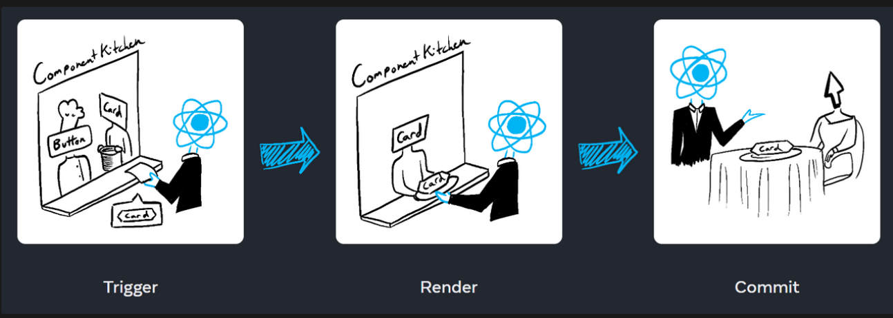

# React JS

<details>
<summary>About React JS</summary>

## About React Js
- ReactJS is a JavaScript library for building user interfaces
- ReactJS is declarative, efficient, and flexible
- It is fast and component-based
- It was initially developed and maintained by Facebook
- React breaks web elements down into reusable components making it easy to mange complex web interfaces.
- React's Virtaul DOM is a JavaScript representation of the actual DOM. When updates are made React compares the current DOM to the virtual DOM and only updates the differences between the two.

## Components
- Components are the foundation upon which you build user interfaces(UI)
- It is the Building blocks of user interface
- In a React app, every piece of UI is a component
- A React component is a JavaScript function that you can sprinkle with markup except:
    - Their names always begin with a capital letter.
    - They return JSX markup
- Each component exists in the same space but works independently
- Splits UI into independent and reusable pieces
- All of the components are being merged in a parent component (the final UI)
- Acceptsinput called props (optional) and returns react element
- Reusable having their own structure and methods


#### 4 ways to define components
- similar in look, different in data
- container component
- No common pattern, but breakdown for working purpose
- Stand-alone component

#### How to Build a Component?
- Export the component
- Define the function
    ```jsx
    export default function Profile() {

    }
    ```
- Add markup
    ```jsx
    retrun (
        
    )
    ```
- Whole component:
    ```jsx
    export default function Profile() {
        retrun (
            
        )
    }
    ```
    without parentheses, any code on the lines after return will be ignored!

#### Advantages of Components
- Code reusability
- Rast development
- Design consistency
- Maintainability (update just one component & get result in all spaces realted to this component)


## JSX
- JSX is a syntax extension for JavaScript
- JSX stands for JavaScript XML
- Lets you write HTML- like markup inside a JavaScript file.
- Under the hood it is transformed into regular JavaScript using compilers like Bable or TypeScript

#### Rules of JSX
- Return a single root element
    - To return multiple elements from a component, wrap them with a single parent tag.
- Close all the tags
- Must use camelCase
    - class --> className
    - onclick --> onClick
    - tabindex --> tabIndex


</details>

<details>
<summary>Getting Start with React</summary>


# Start React with Vite

+ npm create vite@latest project-name -- --template react
+ for proceed press (y)
After that
+ using cd enter the project folder
+ then --> npm install (Create node_modules folder)
+ for run --> npm run dev or npx vite
+ for build --> npm run build or npx vite build (create dist folder)


# Application Running Process:
+ After run project: npx vite --> from main.jsx 

### Folder Structure
+ node_modules
+ public
+ src
    + assets
        + css
        + images
    + pages
    + component


## VS code extension
+ npm intellisense
+ ESLint
+ Auto import- ES6, JSX, TSX.
+ Auto Tag
+ Auto Rename tag
+ Path intelliense
+ Postman
+ Prettier - code formater
+ Snipped
+ Tailwind CSS IntelliSense
+ Vscode react refactor
+ vscode-icons

</details>

<details>
<summary>About React Component</summary>

## What is React Component?
In React, a component is the building block of a user interface. Components allow you to break down complex UIs into smaller, reusable pieces.
There are two main types of React componets:
### 1. Functional Components
These are simple JavaScript functions that accept `props` (data passed from the parent component) and return React elements. They're easy to write and are often preferred for simple UI elements. For example:
```jsx
function Greeting(props) {
  return <h1>Hello, {props.name}!</h1>;
}
```

### 2. Class Components:
 These are ES6 classes that extend `React.Component`. They offer more features, like local state and lifecycle methods (e.g., `componentDidMount, componentDidUpdate`). For example:
 ```jsx
 class Greeting extends React.Component {
  render() {
    return <h1>Hello, {this.props.name}!</h1>;
  }
}
```
Modern React mostly leans towards functional components, especially with the introduction of React Hooks (like useState, useEffect), which allow functional components to handle state and lifecycle features.

### Key Concepts in React Components:
`1. Props:` Short for `proporties,` these are the inputs to a React component. They are passed to components via attributes and are read-only (cannot be modified by the component itself).
`2. State:` They are passed to components via attributes and are read-only (cannot be modified by the component itself).
`3. Lifecycle Methods:` These are methods you can use in class components to hook into different phases of a component's life (mounting, updating, and unmounting).
`4. Hooks:` React hooks (like useState, useEffect) allow you to use state and lifecycle features in functional components without writing a class.

</details>

<details>
<summary>About JSX</summary>

## What is JSX?
JSX stands for JavaScript XML. JSX allows us to write HTML in React. JSX makes it easier to write and add HTML in React. JSX allows us to write HTML elements in JavaScript and place them in the DOM without any `createElement()` and/or `appendChild()` methods.

>We are not required to use JSX, but JSX makes it easier to write React applications.

### JSX Conventions
- We need to return a single parent element in jsx.
- We can implement JS directly in jsx
- All tags self-close in jsx
- ClassName and HTMLFor, not class and for in jsx.
- Write all HTML attributes in camelCase in jsx
- Write inline styles as objects in jsx


</details>


<details>
<summary>About Props</summary>

## What are Props?
- React components use props to communicate with each other.
- Every parent component can pass some information to its child components by giving them props.
- You can pass any JavaScript value through props, including objects, arrays and functions.
- Props are unidirectional
- Props are Immutablep

#### Set value into the component using props
```jsx
// Main Function
    function FunctionName() {
        return (
            <>
                ...
                ...
                <Device name="Laptop" price="45k"></Device>
                ....
            </>
        )
    }

// Component
    function Device(props){
        return (
            <h2>Device Name: {props.name} and Price: {props.price}
        )
    }
```
#### Specifying a Default value for a Prop
```jsx
    function Avatar({person, size}){
        //.....
    }
```

#### Different values of Props
```jsx
    // 1. String literals
    <MyComponent prop="My String value"/>
    // 2. Template literals with variables
    <MyComponent prop={'My String value ${myVariable}'}/>

    // 3. Number literals
    <MyComponent prop={42} />

    // 4.Boolean literals
    <MyComponent prop={fallse} />

    // 5. Plain Obj. literals
    <MyComponent prop={{property: 'Value'}} />

    // 6.Array literals
    <MyComponent prop={['Item_1','Item_2']} />

    // 7. JSX
    <MyComponent prop={<Message who="Joker" />}/>

    // 8. Variables having any kind of value
    <MyComponent prop={myVariable}/>
```

#### Forwarding Props with JSX Spread Syntax
Without spread syntax(it's a repetitive way)

```jsx
    function Profile({person, size, isSepia}){
        return(
            <div className="card">
                <Avatar
                    person={person}
                    size={size}
                    isSepia={isSepia}
                />
            </div>
        );
    }
```

With spread syntax
```jsx
function Profile(props){
    retrun (
        <div className="card">
            <Avatar {...props}/>
        </div>
    );
}

```

</details>

<details>

<summary>File Export & Import</summary>

If we want to access any file components or information we need to export and import file.
- At first create a new file and add `export default` at the begining of the function:
    ```jsx
    export default function Todo(){
        return(
                <li>Accessing File</li>
            )
        }
    ```
- Import the file into main `App.jsx` file to access the information:
    ```jsx
    import FileName from './FileName';
    ```

</details>

<details>
<summary>React Rendering</summary>

### Conditional Rendering
- Conditional rendering is the process of displaying different content based on certain conditions or states.
- It allows you to create dynamic user interfaces that cn adapt to changes in data nad user interactions.

#### Why Conditional Rendering?
- Imporved User Experience: Conditional rendering allows you to create dynamic user interfaces by showing and hiding content based on the user's actions or the application state.
- Improved Performance: By conditionally rendering content, apps work faster byonly showing what's needed and improve the performance of your application.
- Simplified Code: By using conditional statements you can decide what content should be rendered, you can avoid duplicating code and create more modular components.
- Flexibility: By rendering different content based on the application state, you can create components that can be used in different contexts and adapt to different user interactions.

```jsx
// App.jsx
<Todo task="Core Concepts" isDone={true}></Todo>
<Todo task="Try JSX" isDone={false}></Todo>
```
### Conditional Rendering with if statement:
```jsx
// Todo.jsx
// ------Conditional rendering option: 1
export default function Todo({task, isDone}){
    if(isDone === true){
        return <li>Finished: {task}</li>
    }
    else{
        return <li>Work On: {task}</li>
    }
}
```
```jsx
// Todo.jsx
// ------Conditional rendering option: 2
export default function Todo({task, isDone}){
    if(isDone === true){
        return <li>Finished: {task}</li>
    }
    return <li>Work On: {task}</li>
}
```
### Conditional Rendering with ternary operator (?:):
```jsx
// Todo.jsx
// ------Conditional rendering option: 3
export default function Todo({task, isDone}){
    return (
        <li> {isDone ? 'Finished': 'Work on'}: {task} </li>   
    )
}
```
### Conditional Rendering with logical operator(&&,||):
```jsx
// ------Conditional rendering option: 4 && (behive like true)
export default function Todo({task, isDone}){
    return(
        <li>{task} {isDone && ': Done'}</li>
    )
}
// ------Conditional rendering option: 5 || (behive like false)
export default function Todo({task, isDone}){
    return(
        <li>{task} {isDone || ': Do it'}</li>
    )
}
```

</summary>


### Set value into the component using props
```jsx
// Main Function
    function FunctionName() {
        return (
            <>
                ...
                ...
                <Device name="Laptop" price="45k"></Device>
                ....
            </>
        )
    }

// Component
    function Device(props){
        return (
            <h2>Device Name: {props.name} and Price: {props.price}
        )
    }
```

### Set value into the component using destructing
```jsx
// Main Function
    function FunctionName() {
        return (
            <>
                ...
                ...
                <Device name="Laptop" price="45k"></Device>
                ....
            </>
        )
    }

// Component
    function Device({name, price}){
        return (
            <h2>Device Name: {name} and Price: {price}
        )
    }
```
</details>

<details>
<summary>Event Handling</summary>

### Event Handling

React lets you add event handlers to your JSX. Event handlers are your own functions that will be triggered in response to interactions like clicking, hovering, focusing form inputs etc.
Example:
```jsx
<button onClick={myFunction}>Button Name</button>

```

### Adding Event Handler:
```jsx
// Event handling way -1
export default function Button() {
    function handleClick() {
        alert('You clicked me!');
    }

    return (
        <button onClick={handleClick}>Click Me</button>
    );
}

```
```jsx
// Inline Event handler in JSX
<button onClick={function handleClick(){
    alert('You clicked me!');
    }}>
    Click me</button>
```
```jsx
<button onClick={() =>{
    alert('You clicked me!');
}}>Click me!</button>
```

### Rules of Adding Event Handler
- **Event handler functions:**
    - Are usually defined inside your componets.
    - Have names that start with handle, followed by the name of the event.
- **By convention,** it is common to name event handlers as handle followed by the event name:
    - onClick = {handleClick}
    - onMouseEnter = {handleMouseEnter}

**`Note:`** Functions passed to event handlers must be passed, not called!
Example:
```jsx
// passing a function - use it
<button onClick={handleClick}>Click me</button>
```
```jsx
// calling a function - not use it
<button onClick={handleClick()}>Click me</button>
```

</details>

<details>
<summary>React Hook</summary>

### What are react hooks?
Hooks were first introduced in React 16.8. Hooks let you use different React feaatures from your components. You can either use the build-in Hooks or combine them to build your own.

### Rules of Hooks


### Different Types of Hooks
- State hooks
- Context hooks
- Ref hooks
- Effect hooks
- Performance hooks
- Other

### State hooks
- State lets a component "remember" information like user input.
- To add state to a component, use one of these Hooks:
    - `useState`declares a state variable that you can update directly.
    - `useReducer` declares a state variable with the update logic inside a reducer functin.
    ```jsx
        function ImageGallery(){
            const [index, setIndex] = useState(0);
            // ...........
        }
    ```

### Context hooks
- Context lets a component receive information from distat parents without passing it as props.
- useContext reads and subscribes to a context
    ```jsx
        function Button(){
            const theme = useContext(ThemeContext);
            // ...........
        }
    ```

### Ref hooks
- Refs let a component hold some information that isn't used for rendering, lie a DOM node or a timeout ID.
- useRef declares a ref. You can hold any value in ti, but most often it's used to hold a DOM node.
    ```jsx
        function Form(){
            const inputRef = useRef(null);
            // ...........
        }
    ```

### Effect hooks
- Effects let a component connect to and synchronize with external systems. This includes dealing with network, browser DOM, animations, widgets written using a different UI library, and other non-React code.
- useEffect connects a component to an external system.

    ```jsx
        function chatRoom({roomId}){
            useEffect(() => {
                const connection = createConnection(roomId);
                connection.connect();
                return () => connection.disconnect();
            }, [roomId]);
            //.............. 
        }
    ```
</details>

<details>
<summary>React  useState()</summary>

### What exactly is state?
- Components often need to change what's on the scree as a result of an interaction.
- Typing into the form should update the input field, clicking, "next" on an image carousel should change which image is displayed, clicking "buy" should put a product in the shopping cart.
- Components need to "remember" things: the current input value, the current image, the shopping cart. In React, this kind of component-specific memory is called state.

### How to write a useState Hook
The useState hook provides those two things:
- A state variable to retain the data between renders.
- A state setter function to update the variable and trigger React to render the component again.

    

```jsx
    const [counter, setCounter] = useState(0);
    const clickHandlerIncrease = () => {
        const newCount = counter + 1;
        setCounter(newCount);
    }
```

### Why useState() is needed?
To update a component with new data, two things need to happen:
- Retain the data between renders.
- Trigger React to render the component with new data(re-rendering).

Variable do not preserve data between renders and cannto tigger React to render. Hense, useState is needed as it preserves data since it is a memeroy as well trigger React to render with teh help of setter function.

### 5 use cases of useState()
- State management
- Conditional rendering
- Toggle flags (true/false)
- Counter
- Store API data in state

</details>

<details>
<summary>React useEffect</summary>

### What are Effects?
There are two types of logic inside React components:
- `Rendering code:` lives at the top level ofyour component. This is where you take the props and state, transform them, and returnthe JSX you want to see on the screen.
- `Event handlers:` An event handler might update an input field, submit an HTTP POST request to buy a product, or navigate the user to another screen.

Event handler contain "side effects" (they change the program's state) caused by a specific user action (for example, a button click or typing).

### What are side effects in react?
- Not predictable
- Actions which are performed with the "outside world"
- A side effect is performed when we need to reach outside the scope of our current react components to do something.
- React component rendering and side-effect logic are independent

### Some common side effects-
- Making a request to an API for data from a backend server
- To interect with browser APIs (that is, to use document or window directly)/ Manipulating DOM directly
- Using unpredictable timing functions like setTimeout() or setInterval()
- Reading data from local storage

### What is useEffect?
userEffect exists-
- To synchronize a component with an external system
- To provide a way to handle performing these side effects
- Doesn't affect the rendering or performance of the component that it's in
- Performs asynchronous task


### How to write an Effect
To write an Effect, follow these three steps:
1. `**Declare an Effect**` By default, your Effect will run after every render. To declare an Effect in your component, import the useEffect Hook from React
    ```jsx
    import {useEffect} from 'react';
    ```
    - Then call it at the top level of your component and put some code inside your Effect:
    ```jsx
    function MyComponent(){
        useEffect(() => {
            // code here will run after every render
        });
        return <div/>;
    }
    ```
2. `**Specify the Effect dependencies.**` Most Effects should only re-run when needed rather than after every render. For example, a fade-in animation should only trigger whena component appears.
3. `**Add cleanup if needed.**` Some effects need to specify how to stop , undo, or clean up whatevr they were doing. For example, "connect" needs "disconnect".

### Different types of dependency in useEffect
1. Runs after every render
    ```jsx
    useEffect(() => {
        // This runs after every render
    })
    ```
2. Runs only once after initial render
    ```jsx
    useEffect(() =>{
        //Runs only once after initial render
    },[]);
    ```
3. Runs on mount and also if either a or b have change since the last render
    ```jsx
    useEffect(() =>{
        /* This runs on mount *and also* 
        if either a or b have changed
        since the last render*/
    },[a,b]);
    ```

### What is useEffect cleanup function?
- The useEffect cleanup allows us to tidy up our code before our component unmounts.
- When our code runs and results for every render, useEffect also cleans up after itself using the cleanup function.
- The cleanup function prevents memory leaks and removes some unnecessary and unwanted behaviors.
- Prevent unwanted behaviors and optimizes application performance.

</details>

<details>
<summary>Trigger, Render an Commit in React</summary>

## What does Render means?
- Before your components are displayed on screen, they must be rendered by React.
- "Rendering" means that React is calling your component, which is a function.

### Trigger, render and commit
Imagine that your componets are cooks in the kitchen. In this scenario, React is the waiter who puts in requeests from customers and brings them their orders. This process of requesting and serving UI has three steps:

1. Triggering a render(delivering the guest's order to the kitchen)
2. Rendering the componet(preparing the order in the kitchen)
3. Committing to the DOM(placing the order on the table)

    

### Step-1: Trigger a render
There are two reasons for a component to render:
- It's the component's initial render.
- The component's(or one of its ancestors) state has been updated.
#### Initial Render
When your app starts, you need to trigger the initial render. It's done by calling createRoot with teh target DOM node, and then calling its render method with your component
#### Re-renders when state updates
- Once the component has been initially rendered, you can trigger further renders by updating its state with the set function. Updating your component's state automatically queues a render.
- You can imagine these as a restaurant guest ordering tea, dessert, and all sorts of things after puttin gin their first order, depending on the state of their thirst or hunger.

### Step 2: React renders your components
After you trigger a render, React calls your components to figure out what to display on screen.. "Rendering" is React calling your components.
- On initial render, React will call the root component.
- For subsequent renders, React will call the function componet whose state update tirggerd  the render.

This process is recursive: if the updated component returns some other component, React will render that component next, and if that component also returns something, it will render that component next, and as on.

### Step 3: React commits changes to the DOM
After rendering (calling) your components, React will modify the DOM.
- For the initial render, React will use the appendChild() DOM API to put all the DOM nodes it has created on screen.
- For re-renders, React will apply the minimal necessary operations (calculated while rendering) to make the DOM match the latest rendering output.

React only changes the DOM nodes if there's a difference between renders.

</details>

<details>
<summary>Thinking in React way</summary>

### When you build a user interface with React-
**Step-1:** Break it apart into pices called components.
**Step-2:** Describe the different visual states for each of the components.
**Step-3:** Connect the components together so that the data flows through them.

All Steps:
**Step-1:** Break the UI into a component hierarchy
**Step-2:** Build a static version in React
**Step-3:** Find the minimal but componet representation of UI state
**Step-4:** Identify where your state should live
**Step-5:** Add inverse data flow

</details>

<details>
<summary>Type Error Handle</summary>

`prop-types` errors handle: For deactivate the prop-types error go to the  `eslint.config.js` file under the `rules:` section include this rules: `'react/prop-types': 'off'`. 
>It is not the best practice to handle this error. as a beginner it's ok. 
```js
rules: {
      ...js.configs.recommended.rules,
      ...react.configs.recommended.rules,
      ...react.configs['jsx-runtime'].rules,
      ...reactHooks.configs.recommended.rules,
      'react/jsx-no-target-blank': 'off',
      'react-refresh/only-export-components': [
        'warn',
        { allowConstantExport: true },
      ],
      'react/prop-types': 'off' //this is the rule
    },
```

</details>